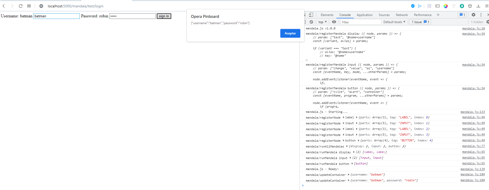

# Dragon Nomada's Toolkit

Autor: Alan Badillo Salas (Dragon Nomada)

## Introduction

This is one of the most important personal portafolio's project.

This **toolkit** is a set of tools and codes to power the web and algorithms. Each project have their own documentation and they are independent among them.

## mandaja.js

The **mandala.js** is a lightness library to convert code comments into functionallity.

For example, if you have some *html-form*.

> Simple HTML Form

```html
<label>Username:</label>
<input placeholder="username">
<label>Password:</label>
<input placeholder="password" type="password">
<button>sign in</button>
```

You can modify the *Form* to have funcionallity with some mandalas

> HTML Form connected with mandalas

```html
<!-- mandala display text @name=username -->
<label>Username: @name</label>
<!-- mandala input change value as username -->
<input placeholder="username">
<!-- mandala display text @pass=password -->
<label>Password: @pass</label>
<!-- mandala input change value as password -->
<input placeholder="password" type="password">
<!-- mandala button click alert container -->
<button>sign in</button>

<!-- mandala.js library -->
<script src="<path>/mandala.js"></script>
<script src="<path>/mandalas/display.mandala.js"></script>
<script src="<path>/mandalas/input.mandala.js"></script>
<script src="<path>/mandalas/button.mandala.js"></script>
<!-- Start the mandalas -->
<script src="<path>/mandala.start.js"></script>
```

Now, you can use or define your own mandalas to use them into your code.

> Example for `mandalas/display.js`

```js
// mandala display <params>
// Ex. mandala display text @name=username
mandalaJS("display", ({ node, params }) => {
    // params: ["text", "@name=username"]
    const [variant, alias] = params;

    if (variant === "text") {
        // alias: "@name=username"
        // key: "@name"
        // containerKey: "username"
        const [key, containerKey] = alias.split("=");

        // template: "Username: @name"
        const template = node.textContent;

        // When container is updated
        mandalaJS.subscribeUpdateContainer(() => {
            // Update textContent of the `node`
            // Replace all keys ("@name") with container[containerKey] (container["username"])
            node.textContent = template.replace(new RegExp(key, "g"), mandalaJS.container[containerKey]);
        })
    }
})
```

This is the result. You can take anyone html code and integrate `mandala.js` to extend functionallity.



Try to test your own form or something.

[Check the complete documentation of mandala.js](./mandala/docs/readme.md)
